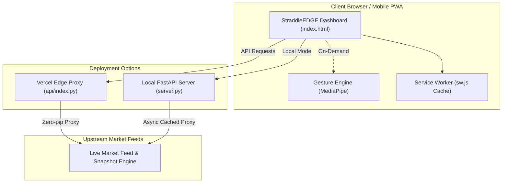

# ⚡ StraddleEDGE

> **High-Performance Institutional-Grade Index Options Research & Analytics Dashboard**  
> *Real-time straddle premiums, expected move corridors, Greeks, IV skew, and Volatility Risk Premium (VRP) across major Indian indices.*

---

[](https://vercel.com)
[](https://python.org)
[](https://web.dev/progressive-web-apps/)
[](LICENSE)
[]()

---

## 📌 Overview

**StraddleEDGE** is an ultra-low-latency options analytics workstation tailored for derivative traders, quantitative researchers, and active option sellers. Designed for speed, resilience, and actionable market intelligence, it delivers real-time straddle decay tracking, IV skew curves, Greeks evolution, and open interest concentration across all premier exchange-traded indices.

The workstation operates on a **dual-architecture model**:
1. **Edge Serverless (Vercel)**: Zero external pip dependencies, pure standard library edge proxy, and immutable asset delivery via global CDN.
2. **Local Workstation Server (FastAPI)**: In-memory 3-second cache layer, asynchronous request executor, and instantaneous local deployment.

---

## 🎯 Key Features

### 1. 📊 Real-Time Straddle & Strangle Analytics
* **Live At-The-Money (ATM) Straddle Pricing**: Continuous premium calculation and intraday decay velocity.
* **Expected Move Corridors**: Dynamic upper and lower breakeven boundaries projected from option implied volatility.
* **Historical Decay Trajectory**: Compare current decay against historical expiry profiles.

### 2. 🧮 Option Greeks & Volatility Intelligence
* **Full Greeks Matrix**: Live Delta, Gamma, Theta, and Vega across strikes and maturities.
* **Volatility Risk Premium (VRP)**: Real-time spread between Implied Volatility (IV) and Realized Volatility (RV).
* **IV Skew & Smile Visualization**: Real-time identification of put/call skew imbalances.

### 3. 📈 Open Interest (OI) & Sentiment Dynamics
* **Strike-by-Strike OI Heatmap**: Cumulative and change in Open Interest across Call and Put contracts.
* **Dynamic Put-Call Ratio (PCR)**: Track institutional sentiment shifts and support/resistance concentrations.
* **Max Pain Tracker**: Live pinpointing of market maker strike pinning zones.

### 4. 🖐️ Contactless Gesture Engine
* **MediaPipe AI Camera Integration**: Cycle charts, change strikes, and inspect order sheets hands-free via contactless hand gestures.
* **Conditional Loading**: Zero performance overhead for standard sessions—gesture modules load strictly on-demand.

### 5. 📱 Progressive Web App (PWA) & Offline Shell
* **Installable Native Experience**: Add to desktop or mobile home screen with custom standalone viewport.
* **Offline Service Worker**: Instant initial render with asset caching and failure recovery shims.

---

## 🏛️ Supported Indices

| Index | Symbol | Exchange | Strike Step | Lot Size |
| :--- | :--- | :--- | :--- | :--- |
| **NIFTY 50** | `NIFTY` | NSE | 50 | 25 |
| **BANK NIFTY** | `BANKNIFTY` | NSE | 100 | 15 |
| **FIN NIFTY** | `FINNIFTY` | NSE | 50 | 25 |
| **MIDCAP NIFTY** | `MIDCPNIFTY` | NSE | 25 | 50 |
| **S&P BSE SENSEX** | `SENSEX` | BSE | 100 | 10 |
| **BSE BANKEX** | `BANKEX` | BSE | 100 | 15 |

---

## ⚙️ Architecture & Data Flow



---

## 🔬 Frontend Engineering & Resilience

StraddleEDGE implements mission-critical frontend resilience patterns:

* **Bundle-Failure Guard (`__apexBundleFail`)**: An inline, dependency-free diagnostic harness that intercepts failed asset fetches. If any bundle fails to load, it displays an immediate root-cause diagnosis instead of a blank screen.
* **Deferred Handler Shim (`__APEXSTUBS`)**: Scripts load with `defer` for maximum paint speed. Pre-bound queueing stubs buffer user interactions until bundles initialize, ensuring zero dropped clicks.
* **Bounded Idle Loader (`requestIdleCallback`)**: Non-critical modules (intelligence, panels, overrides) load during idle cycles with a strict 2000ms safety timeout to prevent thread starvation.
* **Zero Remote Web Fonts**: Eliminates external Google Font round-trips and layout shifts (`display=swap`) by utilizing high-precision native system font stacks (`--mono`, `--disp`).

---

## 📁 Repository Structure

```text
straddleedge/
├── api/
│   └── index.py            # Vercel Serverless Function (pure Python standard library)
├── app/
│   ├── auth.js             # Authentication & session token lifecycle
│   ├── boot.js             # Application initialization & queue replayer
│   ├── chart.min.js        # High-performance charting engine
│   ├── core.js             # Core data feed parser, state engine & math
│   ├── intelligence.js     # Volatility, regime & probability models
│   ├── mobile.js           # Mobile responsive layout & touch gestures
│   ├── overrides.js        # User custom strike overrides & presets
│   ├── panels.js           # Modal dialogs & analytical sub-sheets
│   ├── pwa-install.js      # PWA installation prompt handler
│   ├── scheduler.js        # High-frequency poll scheduler & heartbeat
│   ├── strip.js            # Top ticker strip & index tape
│   └── workstation.js      # Multi-panel workstation layout manager
├── pwa/
│   ├── apple-touch-180.png # iOS home screen icon
│   ├── icon-192.png        # Android & desktop application icon
│   └── mark.png            # Brand mark asset
├── static/                 # Mirrored static distribution directory for server.py
├── .gitignore              # Git ignore rules
├── .vercelignore           # Deployment filter for Vercel builds
├── DEPLOY_VERCEL.md        # Comprehensive Vercel deployment walkthrough
├── gesture-engine.js       # Contactless webcam gesture controller
├── index.html              # Main workstation entry point & critical CSS
├── LICENSE                 # MIT License
├── manifest.json           # Progressive Web App web manifest
├── requirements.txt        # Server dependencies (clean standard library for Vercel)
├── run.bat                 # One-click Windows development launcher
├── server.py               # Standalone FastAPI development server
├── sw.js                   # Service worker for offline shell & asset caching
└── vercel.json             # Vercel edge routes, rewrites & HTTP security headers
```

---

## 🚀 Quick Start (Local Development)

### Prerequisites
* **Python 3.9+** installed on your system.

### Option A: Windows 1-Click Launch
Double-click `run.bat` or run from PowerShell:
```cmd
run.bat
```

### Option B: Manual CLI Setup
1. Clone the repository:
   ```bash
   git clone https://github.com/praveen37x/Straddle-Edge.git
   cd Straddle-Edge
   ```
2. Install local server dependencies:
   ```bash
   pip install fastapi uvicorn requests
   ```
3. Start the workstation server:
   ```bash
   python server.py
   ```
4. Open your browser:
   * **Workstation Dashboard**: [http://localhost:8000/edge](http://localhost:8000/edge)
   * **Root URL**: [http://localhost:8000/](http://localhost:8000/)

---

## ☁️ Deploying to Vercel

The project is pre-configured with `vercel.json` and `api/index.py` for instantaneous Vercel deployment with **zero build configuration**:

1. Push this repository to your GitHub account:
   ```bash
   git add .
   git commit -m "Deploy StraddleEDGE production workstation"
   git push origin main
   ```
2. Visit [Vercel](https://vercel.com/new).
3. Import your `straddleedge` repository.
4. Keep the default settings:
   * **Framework Preset**: `Other`
   * **Root Directory**: `./`
   * **Build Command**: *(empty)*
   * **Output Directory**: *(empty)*
5. Click **Deploy**. Your dashboard will be live on Vercel's global edge network in under 30 seconds!

---

## 🔐 Security & Headers

Configured via `vercel.json`:
* `X-Frame-Options: SAMEORIGIN` — Clickjacking protection.
* `X-Content-Type-Options: nosniff` — Strict MIME type enforcement.
* `Access-Control-Allow-Origin: *` — Unrestricted cross-origin capability for analytical widgets.
* `Cache-Control: public, max-age=31536000, immutable` — Immutable 1-year caching for versioned application bundles.

---

* **Project**: StraddleEDGE Institutional Analytics

---

## 📄 License

This project is licensed under the [MIT License](LICENSE).
